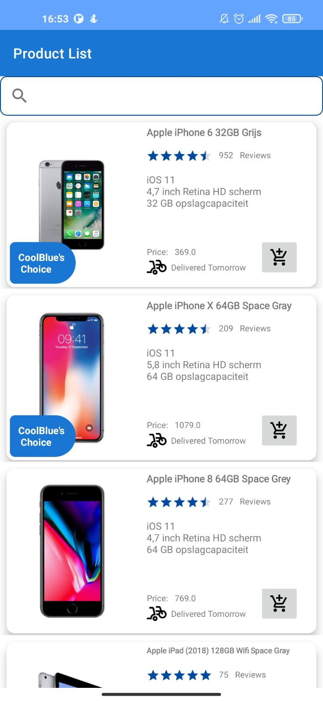
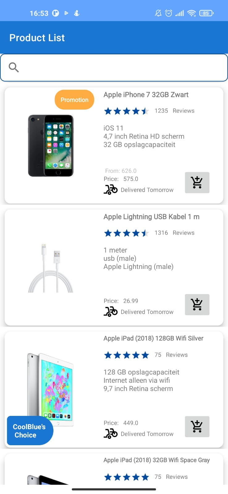
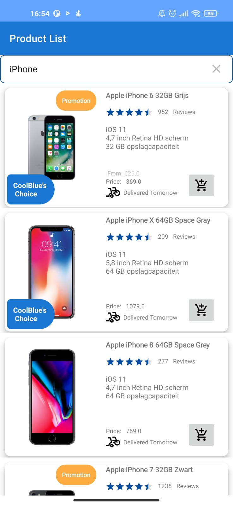
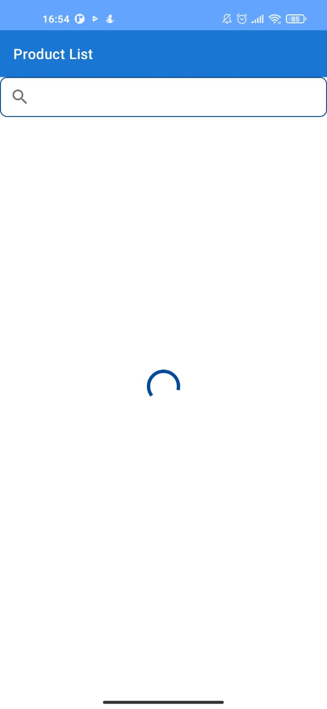

# ProductList Project

Project created for the CoolBlue code challenge. The project consists of a product list and search bar, with some images and other information about the product that is available for purchase.

# Tecnologies

- Coroutines
- LifeCycle/ViewModel
- Retrofit
- Moshi
- Glide
- Paging 3
- Hilt
- Mockito(Test Lib)
- PowerMockito(Test LIb)

## Architecture & Design Pattern

- MVVM
- Adapters

## Sreenshots

|  |  |
|--|--|
|  |  |